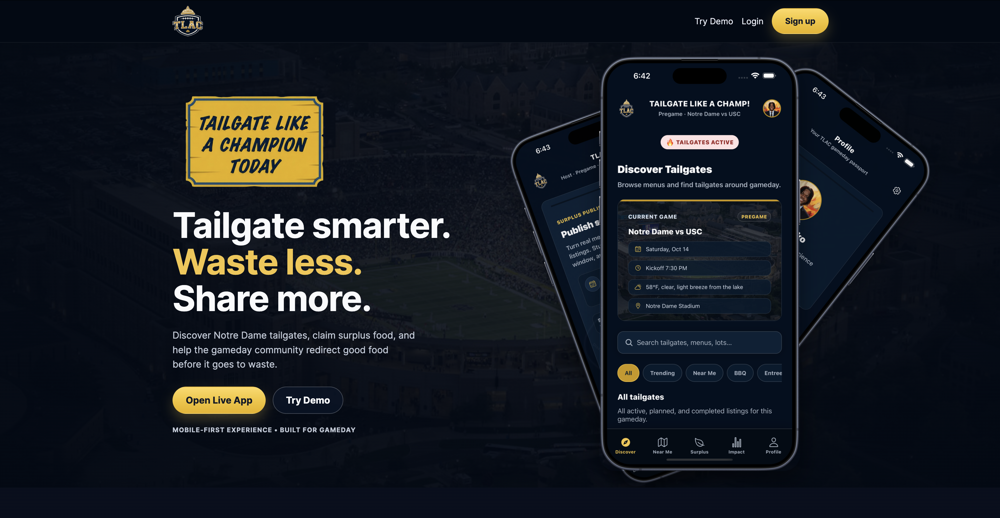
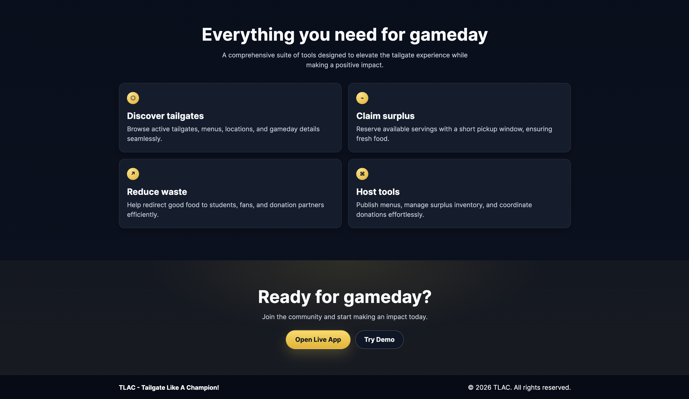
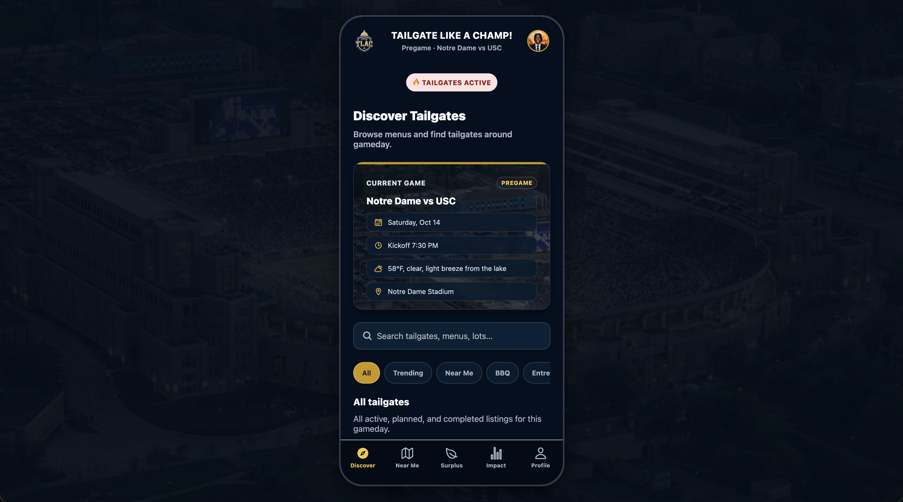
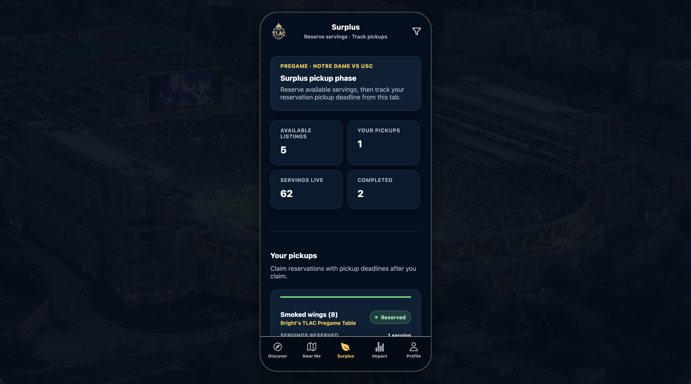
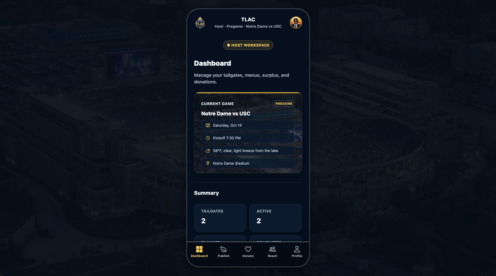
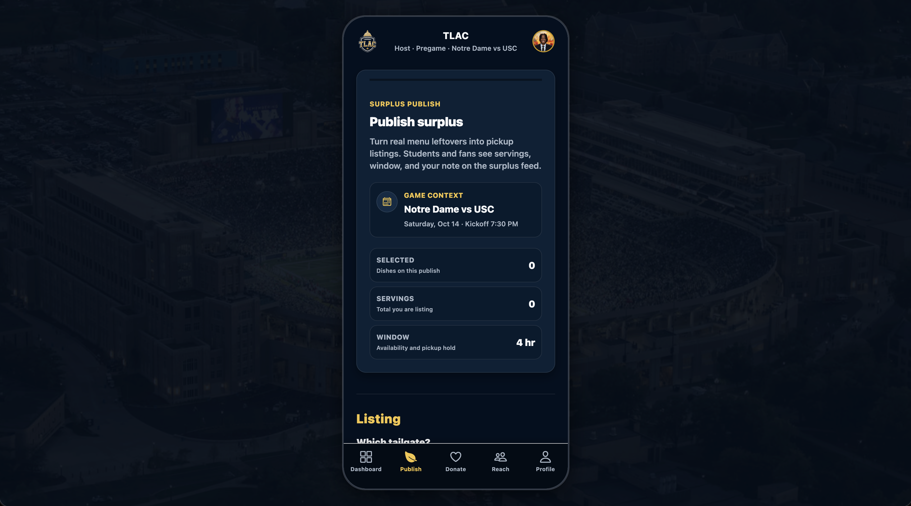

# TLAC - Tailgate Like A Champion Today

TLAC is a mobile-first Expo + React Native app for Notre Dame gameday tailgates. It helps students, fans, and hosts discover tailgates, publish menus, claim surplus food, coordinate pickups, and route remaining food to donation partners instead of letting it go to waste.

The app includes a live remote API mode, a mock demo mode, a static landing page, and a GitHub Pages deployment that serves both the production app and demo app side-by-side.



## Live links

| Experience | URL |
|---|---|
| Landing page | `https://brightdikko.github.io/tlac-tailgate-like-a-champion-today/landing/` |
| Live app | `https://brightdikko.github.io/tlac-tailgate-like-a-champion-today/` |
| Demo app | `https://brightdikko.github.io/tlac-tailgate-like-a-champion-today/demo/` |

> The live app is built in `remote` mode and expects an HTTPS API base URL. The demo app is built in `mock` mode and runs from seeded local data.

## What TLAC does

TLAC supports two connected gameday experiences:

### Student / Fan experience

- Discover active and planned tailgates around Notre Dame.
- Search and filter by food type, trending tailgates, and nearby listings.
- View tailgate details, host information, locations, ratings, tags, and menus.
- Claim available surplus servings.
- Track pickup reservations with a countdown timer.
- Confirm or release pickups.
- View personal or community impact totals.

### Host experience

- Create tailgate listings.
- Add and edit menu items.
- Manage tailgate status and visibility.
- Publish surplus servings after or during gameday.
- Preview student/fan reach.
- Close surplus listings when pickup windows end.
- Find donation centers and log donations.
- Track host profile, active tailgates, available servings, and donation impact.

## Product screenshots

### Landing page




### Web app

| Discover | Surplus |
|---|---|
|  |  |
| Host dashboard | Publish surplus |
|---|---|
|  |  |

## Tech stack

- Expo SDK 54
- React 19
- React Native 0.81
- Expo Router 6
- Redux Toolkit + RTK Query
- TypeScript
- React Native Web static export
- Expo Secure Store for auth token persistence
- GitHub Pages deployment
- Static landing page in `landing/`

## Project structure

```text
app/
  Expo Router app routes
  (student)/           Student / Fan tab shell
  (host)/(tabs)/       Host tab shell and host workflows
  host/                Legacy/deep-link host routes
  student/             Legacy/deep-link student routes
src/
  api/                 RTK Query base API, endpoints, mappers, response helpers
  components/          Shared React Native UI components
  data/json/           Seeded mock data
  features/auth/       Auth slice, selectors, bootstrap, route helpers
  mocks/               Mock API handlers and mock database
  redux/               Store setup
  services/            Env, API URL, health check, token storage
  theme/               Colors, spacing, typography, tab bar styles
  types/               App and API TypeScript types
  utils/               Shared helpers
landing/
  Static marketing landing page
docs/
  API contract and README assets
```

## App routes

### Public / onboarding

| Route | Purpose |
|---|---|
| `/` | Splash screen |
| `/welcome` | Product welcome / demo entry |
| `/role-select` | Choose Student/Fan or Host starting view |
| `/login` | Sign in |
| `/register` | Create account |
| `/dev-api` | Developer API diagnostics |

### Student / Fan

| Route | Purpose |
|---|---|
| `/discover` | Browse and filter tailgates |
| `/near-me` | Nearby tailgates sorted by distance |
| `/surplus` | Claimable surplus feed |
| `/impact` | Community or personal impact totals |
| `/profile` | Student/Fan profile |
| `/student/tailgate-detail` | Tailgate detail and menu |
| `/student/pickup-timer` | Active pickup reservation timer |
| `/student/pickup-success` | Pickup confirmation |

### Host

| Route | Purpose |
|---|---|
| `/dashboard` | Host dashboard |
| `/create-tailgate` | Create a tailgate and draft menu |
| `/tailgate-manage` | Manage a selected tailgate |
| `/edit-tailgate` | Edit tailgate details and menu |
| `/publish` | Publish surplus from menu items |
| `/donate` | Browse donation centers |
| `/reach` | Preview student/fan visibility |
| `/host/log-donation` | Log donation handoff |
| `/host/donation-center-detail` | Donation center detail |
| `/host/donation-success` | Donation confirmation |
| `/host/surplus-published` | Surplus publish confirmation |

## Getting started

Install dependencies:

```bash
npm install
```

Start the default Expo dev server:

```bash
npm run start
```

Run platform shortcuts:

```bash
npm run ios
npm run android
npm run web
```

Run type checking:

```bash
npm run typecheck
```

Run linting:

```bash
npm run lint
```

## API modes

The app supports two API modes.

| Mode | Description |
|---|---|
| `mock` | Uses local seeded data and in-memory mock handlers. Best for demos and UI work. |
| `remote` | Uses the configured backend API via `EXPO_PUBLIC_API_BASE_URL`. |

Expo public env vars are read at build time, so restart Metro with `--clear` after changing them.

## Environment variables

| Variable | Values | Default |
|---|---|---|
| `EXPO_PUBLIC_API_MODE` | `mock` or `remote` | `mock` |
| `EXPO_PUBLIC_API_BASE_URL` | Full REST API base URL ending in `/api/v1` | `http://localhost:3000/api/v1` |
| `EXPO_PUBLIC_BASE_PATH` | Static web base path for Expo export | `/tlac-tailgate-like-a-champion-today` |

## Development commands

### Mock mode

```bash
npm run start:mock
```

Equivalent manual command:

```bash
EXPO_PUBLIC_API_MODE=mock npx expo start --clear
```

### Remote mode

```bash
npm run start:remote
```

Equivalent manual command:

```bash
EXPO_PUBLIC_API_MODE=remote \
EXPO_PUBLIC_API_BASE_URL=https://ministries-generic-inputs-spotlight.trycloudflare.com/api/v1 \
npx expo start --clear
```

### Remote mode against local backend

```bash
EXPO_PUBLIC_API_MODE=remote \
EXPO_PUBLIC_API_BASE_URL=http://localhost:3000/api/v1 \
npx expo start --clear
```

For physical devices, use your LAN IP instead of localhost:

```bash
EXPO_PUBLIC_API_MODE=remote \
EXPO_PUBLIC_API_BASE_URL=http://192.168.1.10:3000/api/v1 \
npx expo start --clear
```

## Web builds

The repo deploys two static Expo web builds:

1. Production app at `/tlac-tailgate-like-a-champion-today`
2. Demo app at `/tlac-tailgate-like-a-champion-today/demo`

Build production web:

```bash
npm run build:web:prod
```

Build demo web:

```bash
npm run build:web:demo
```

Build both into one deployable `dist/` folder:

```bash
npm run build:web:all
```

Preview the combined build locally:

```bash
npm run build:web:all
npm run preview:web
```

Deploy to GitHub Pages:

```bash
npm run deploy:web
```

## GitHub Pages deployment model

`npm run build:web:all` is the source of truth for deployment.

It does the following:

1. Clears previous `dist` and `dist-demo` folders.
2. Builds the production app into `dist`.
3. Builds the mock demo app into `dist-demo`.
4. Copies `dist-demo` into `dist/demo`.
5. Copies the static landing page into `dist/landing`.
6. Adds `.nojekyll` for GitHub Pages.
7. Leaves one deployable static folder at `dist/`.

Because Expo public env vars are build-time constants, production and demo must be exported separately.

## Landing page

The landing page lives in:

```text
landing/
  index.html
  styles.css
  script.js
  landing-assets/
```

It is copied into the production deploy under:

```text
dist/landing/
```

The page includes:

- TLAC brand hero
- Notre Dame stadium background
- mobile mockup screenshots
- feature cards
- links to the live app and demo app

Landing page assets currently expected by the static page:

```text
landing/landing-assets/TLAC-logo.png
landing/landing-assets/notre-dame-stadium.jpg
landing/landing-assets/tailgate-like-a-champion-today-sign.png
landing/landing-assets/discover-screen-mobile-mock.png
landing/landing-assets/surplus-screen-mobile-mock.png
landing/landing-assets/profile-screen-mobile-mock.png
```

## API notes

The frontend API contract is documented in:

`docs/api-contract.md`

Important details:

- Application REST calls use `/api/v1`.
- Health checks use the API host root at `/health`, not `/api/v1/health`.
- Public Student/Fan browsing works without auth in remote mode.
- Host workflows and user-specific routes require authentication.
- Auth uses Bearer access tokens.
- On 401, the app attempts token refresh once using `/auth/refresh`.
- Tokens are persisted through `expo-secure-store`.

## Remote API URL note

GitHub Pages is served over HTTPS, so the deployed web app must use an HTTPS API URL. Browsers block HTTPS pages from calling insecure HTTP APIs as mixed content.

The current remote dev script uses a temporary Cloudflare tunnel URL:

`https://ministries-generic-inputs-spotlight.trycloudflare.com/api/v1`

If the tunnel restarts and the URL changes, update the scripts in `package.json`, rebuild, and redeploy.

## Mock data

Mock/demo mode uses seeded JSON data from:

`src/data/json/`

The mock API handlers live in:

`src/mocks/handlers/`

Mock mode supports local flows for:

- registration
- login
- demo login
- tailgate browsing
- menu reads and writes
- surplus publishing
- surplus claims
- pickup confirmation and release
- donation logging
- impact display

## Auth behavior

In remote mode:

- Student/Fan browse surfaces are public.
- Claiming surplus while signed out redirects to login with a safe return path.
- After login, the app returns to Surplus and highlights the intended claim.
- Host tab routes require a valid authenticated session.
- Stored tokens are restored on launch by AuthBootstrap.
- Invalid or expired sessions are cleared.

In mock mode:

- Demo Mode creates a frictionless local session.
- Registered mock accounts live in memory for the current app session.
- Mock data resets when the app reloads.

## Quality checks

Before opening a PR or deploying:

```bash
npm run typecheck
npm run lint
npm run build:web:all
```

Recommended manual smoke test:

1. Open the demo app.
2. Continue in Demo Mode.
3. Browse Discover.
4. Open a tailgate detail.
5. Claim a surplus item.
6. Confirm pickup.
7. View Impact.
8. Open Host Dashboard.
9. Create a tailgate.
10. Add menu items.
11. Publish surplus.
12. Open Surplus and confirm the new listing appears.
13. Open Donate and log a donation.
14. Rebuild and preview the static web export.

## Design system

The app uses a Notre Dame-inspired dark navy and gold visual system.

Core theme files:

- `src/theme/colors.ts`
- `src/theme/spacing.ts`
- `src/theme/typography.ts`
- `src/theme/radii.ts`
- `src/theme/tabBar.ts`

Shared UI components live in:

`src/components/`

Key reusable components include:

- Screen
- Card
- AppHeader
- HostBrandedHeader
- PrimaryButton
- SecondaryButton
- TailgateCard
- SurplusCard
- FoodItemCard
- MetricCard
- StatusChip
- FilterChip
- SearchBar
- UserAvatar
- WebPhoneFrame

## License

Private project.
